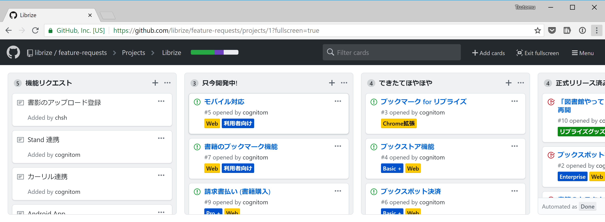

# リブライズ ～すべての本棚を図書館に～

> このリポジトリは、[リブライズ](https://librize.com)の機能リクエストや開発状況をまとめる目的で運用されています。

- [リブライズの開発状況はこちら](https://github.com/librize/feature-requests/projects/1?fullscreen=true)

## リブライズのコミュニティサポート

リブライズへの質問・要望は、コミュニティサイト「リブライズCafe」へお寄せください。(リブライズへのサインアップが必要です。)

- [コミュニティサイト「リブライズCafe」](https://cafe.librize.com/)

## リブライズの有償サポート

自治体や企業向けに、有償サポートプランも提供しています。導入やプランについてのお問い合わせは、下記メール / 電話まで、お気軽にどうぞ。

- 導入・有償サポートお問い合わせ
  - メール: welcome@librize.com
  - 電話: 03–4540–9929
  
- 資料: [リブライズ導入のご提案](https://medium.com/librize/%E3%83%AA%E3%83%96%E3%83%A9%E3%82%A4%E3%82%BA%E5%B0%8E%E5%85%A5%E3%81%AE%E3%81%94%E6%8F%90%E6%A1%88-b4e6537bddd9)

## GitHub アカウントをお持ちの方へ

[Issues](https://github.com/librize/feature-requests/issues)にて、以下を受け付けています。

- **機能リクエスト**: どんな機能? どんなユーザ向け? など記入
- **バグ報告**: バグの発生するURL、発生状況など記入

※質問についてはお受けできませんので、Facebookグループの方にお願いします。
